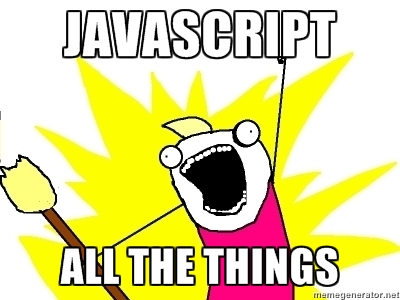

# JavaScript Introduction

## Agenda
* Brainstorm (Ruby v. Javascript)
* History of Javascript
* Understand Data Types
  * Comments
  * Numbers
  * Values & Expressions
  * Conditionals
  * Reference Types
  * Undefined
  * False
  * Arrays
* Javascript Object Literal 
* Javascript Control Flow
  * Conditionals (if/else)
  * While loop
  * For loop
  * Switch case

##Objectives
* Be able to use various JS data types
* Be able to control flow operators in JS
* Be able to manipulate JS object literals
  
## History of Javascript


* Not to be confused with Java, but it is the baby child of Java syntax & Scheme principles
* Created in 10 days in May 1995 by [Brendan Eich](http://en.wikipedia.org/wiki/Brendan_Eich)
* It's an exciting time to learn Javascript! It's the language that enables web pages to respond to user interaction beyond the basic level.

## Why Javascript? 


Simple answer: We want high performance web sites!

*But what does this mean?*

* Client side programming:
  * Interaction with the DOM
  * Respond to DOM events: click, submit...
  * Send requests to the server.
  * Acts on response from the server.    
* Loosely-typed language: you don't have to explicitly declare what type of data the variables are. You just need to use the var keyword to indicate that you are declaring a variable, and the interpreter will work out what data type you are using from the context, and use of quotes.
  * That is, JS figures out the type based on value, and the type can change:

  ```
  var x;
  x = 2;
  x = 'Hi';
  ```

# Getting Started
## Node Install

Since we have `brew` installed we can just install node with it

```
$ brew install node
```
or if you're feeling more browser friendly try the following [node link](http://nodejs.org/download/).

Once finished, you should be able to interact with the `node` repl by saying

```
$ node 
``` 

or you can run a javascript file like the one below

`hello.js`

```
console.log("hello world!")
```

by using the pattern `node <filename>` in javascript.

```
$ node hello.js
```
you can also open the Javascript console in the browser:

[http://webmasters.stackexchange.com/questions/8525/how-to-open-the-javascript-console-in-different-browsers](How to open the JavaScript console in different browsers?)

## Comments in Javascript:
* Ruby uses '#' to indicate a comment line.
* JavaScript uses '//' for line comment.

## Numbers:
* Ruby has Integers and Floats
* JavaScript only has Numbers

## Values & Expressions
* Computers return values when you give them expressions. 
* Give the computer a value and it returns a value, thus values are expressions as well.
  
  ```
  // values are expressions
    console.log(42);

    // addition is an expression
    console.log(2 + 2);

    // string concatenation is an expression
    console.log("hello" + " world");
    ```
### Exercise #1: The Fortune Teller

  Why pay a fortune teller when you can just program your fortune yourself?

  - Store the following into variables: number of children, partner's name, geographic location, job title.
  - Output your fortune to the screen like so: "You will be a X in Y, and married to Z with N kids."

## Conditionals: always use Triple Equal "===" or "!=="
* Check to see if two values are identical with the "===" strict equality.
  
  ```
    console.log("Always use triple equal sign to test equality.")

    console.log(42 === 42);
    //=> true

    console.log(3 === "3");
    //=> false

    // Double equal operator gives the wrong result!!
    console.log(3 == "3");
    //=> true

    console.log(2 + 2 === 4);
    //=> true

    console.log("foo" !== "bar");
    //=> true
    ```
    

  ```
  console.log("if - else if - else:")
  // var state = "red";
  var state = "green";
  // var state = "blue";

  // "message" is an example of a JavaScript Object Literal.
  var message = {
                "failing": "Tests are failing.",
                "passing": "Tests are passing.",
                "refactor": "Time to refactor."
              }
              
  if (state === "red") {  
    console.log(message.failing);
  } else if (state === "green") {
    console.log(message.passing);
  } else { // Time to refactor.
    console.log(message.refactor);  
  }
  ```
  
## Exercise #2: The World Translator
- Write a function named helloWorld that:
  - takes 1 argument, a language code (e.g. "es", "de", "en")
  - returns "Hello, World" for the given language, for atleast 3 languages. It should default to returning English.
- Call that function for each of the supported languages and log the result to make sure it works.  
    
## Reference Types: 
- So what kinds of values might be the same type and have the same contents, but not be considered identical to JavaScript?
  - Even if they have the same values and are the same type, reference types are not strictly equal.
* Arrays are unique structures.
* Try this in your console:

  ```
    console.log("Arrays are reference-type data structures.")
    console.log([1,2,3] === [ 2-1, 1+1, 2+1]);

    console.log([1,2,3] === [1,2,3]);
    ```

## Undefined
* When something is "undefined", it represents a value that hasn't been defined.
* Oddly enough "undefined" is a value.

    ```
    console.log("undefined is a value-type.");
    console.log(undefined === undefined);
    //=> true
    ```


## False
* 0, false, null, undefined, Empty String: ""
    
    ```
    console.log("False Tester:");
    // Try: 0, "", undefined, null, false. Anything else is true!
    if(0) { 
      console.log(true);
    } else {
      console.log(false);
    }
  ```

##null
* Represents an explicitly empty value
  
## JavaScript Object Literals 
* An object literal is a list of zero or more pairs of property names and associated values of an object, enclosed in curly braces ({}).

  ```
  var mickey_mouse = {
                    "first_name": "Mickey",
                    "last_name": "Mouse",
                    "address": "Disneyland"
                  }
  var mickey = {
                    "first_name": "Mickey",
                    "last_name": "Mouse",
                    "address": "Disneyland"
                  }

  // JS Object Literals are reference types
  // Access a literal value with ".key" syntax!
  console.log(micky_mouse.first_name);
  // This also works
  console.log(micky_mouse["first_name"]);

  console.log("Are JS Object Literals values? ")
  if(micky_mouse === micky ) {
    console.log(true );
  } else {
    console.log(false );
  }
  ```

## For loop

  ```
  var mixed = [1, "two", "three", true];
  
  console.log("For Loop:")
  
  // Most common mistake is using commas instead of "semicolons" inside the loop declaration.
  
  for(var i = 0; i < mixed.length; i++) {
    console.log("The element at index " + i + " is: " + mixed[i]); 
  }
  ```
  
## While loop
  ```  
  var a = [1,2,3,4];
  var b = [1,2,3,4];

  console.log("While Loop:")
  
  var i = 0;
  
  while(i < a.length) {
    console.log("The element at index " + i + " is: " + a[i]);
    i++; 
  }
  ```

###Exercise #3: 
- Write a for loop that will iterate from 0 to 20. For each iteration, it will check if the current number is even or odd, and report that to the screen (e.g. "2 is even").
  
## Switch Case
  
  ```
  var expression = "label2"

  switch (expression) {
    case "label1":
        console.log("First case: label1");
        break;
    case "label2":
        console.log("Second case: label2");
        break;
    case "labelN":
        console.log("Nth case: labelN");
        break;
    default:
        console.log("Default case.");
        break;
    }
   ```


- ### Before Lunch Exercise: JavaScript Calculator

  - Create a calculator in JavaScript.

    - Prompt the user to enter an operator and two operands.
Support the following operations: addition, subtraction, multiplication, and division.
Output may appear in the console or in an alert.  

## Resources:
* [Code School free course on the Developer Tools](https://www.codeschool.com/courses/discover-devtools)
* [JavaScript Alonge](https://leanpub.com/javascript-allonge/read#leanpub-auto-a-pull-of-the-lever-prefaces)
* [MDN JavaScript Reference](https://developer.mozilla.org/en-US/docs/Web/JavaScript/Reference)

##Style Guide
Check out some style guides for coding  

- [http://nerds.airbnb.com/our-javascript-style-guide](Airbnb JS Guide)
- [https://github.com/zillow/javascript](Zillow JS Guide) 